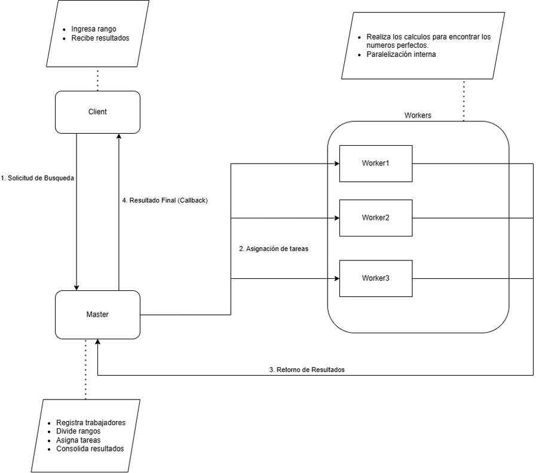

# BÚSQUEDA DISTRIBUIDA DE NÚMEROS PERFECTOS

## Integrantes:

* Heiner Danit Rincón Carrillo - A00402510
* David Vergara Laverde - A00402237
* Rubén Darío Marquinez Rincón - A00401286
* Isabella Cuervo Vargas - A00401334

---

### Descripción del Problema: Búsqueda de Números Perfectos

Un **número perfecto** es un entero positivo que es igual a la suma de sus divisores propios positivos, excluyéndose a sí mismo. Por ejemplo, 28 es perfecto porque $1 + 2 + 4 + 7 + 14 = 28$. Encontrar números perfectos en rangos numéricos elevados es una tarea **computacionalmente intensiva**, con una complejidad algorítmica de $O(N\sqrt{N})$ para un rango de $N$ números.

Dada esta alta complejidad, este problema es un candidato ideal para la **computación distribuida**. Al dividir el rango total de búsqueda en subrangos más pequeños, el trabajo puede distribuirse entre múltiples nodos (trabajadores) y procesarse en paralelo, optimizando significativamente el tiempo de ejecución.

### Diseño del Modelo Cliente-Maestro-Trabajadores:

<p align="center">
  
  <br>
  <em>Figura 1: Esquema de diseño del modelo cliente-maestro-trabajadores</em>
</p>

El sistema se organiza bajo una arquitectura **Cliente-Maestro-Trabajadores (Master-Workers)**, facilitando la distribución eficiente de la carga computacional y la escalabilidad.

* **Cliente (GUI / Consola):**
    * **Cliente GUI (JavaFX):** Proporciona una interfaz gráfica para que el usuario ingrese el rango de búsqueda (inicio y fin). Envía la solicitud al Maestro y espera la respuesta de forma **asíncrona** a través de un mecanismo de callback. Muestra los números perfectos encontrados y el tiempo total de ejecución.
    * **Cliente de Consola:** Una alternativa más simple para pruebas rápidas. Envía una solicitud **síncrona** al Maestro y espera la respuesta directamente en la consola.

* **Maestro (Publisher):**
    * Actúa como el coordinador central del sistema.
    * Recibe las solicitudes de búsqueda del Cliente.
    * Gestiona una piscina de **Trabajadores** disponibles, que se registran con él al iniciar.
    * Divide el rango total de búsqueda en subrangos más pequeños, distribuyéndolos equitativamente entre los trabajadores conectados.
    * Recolecta los resultados (números perfectos encontrados) de cada trabajador.
    * Consolida todos los resultados y los envía de vuelta al Cliente que originó la solicitud, utilizando el mecanismo de **callback** para el cliente GUI.

* **Trabajadores (Subscriber):**
    * Son las unidades de procesamiento encargadas de realizar el cálculo intensivo.
    * Cada trabajador se registra con el Maestro al iniciar.
    * Recibe un subrango asignado por el Maestro.
    * Realiza la búsqueda de números perfectos dentro de su subrango.
    * **Importante:** Utiliza **paralelización interna** con múltiples hilos para optimizar el cálculo dentro de su propio nodo, aprovechando al máximo los núcleos de su CPU.
    * Devuelve la lista de números perfectos encontrados al Maestro.

### Estrategia de Distribución y Coordinación:

1.  **Solicitud y Asignación:** El Cliente envía una solicitud al Maestro con el rango deseado y su proxy de callback. El Maestro divide este rango en $N$ subrangos (donde $N$ es el número de Trabajadores disponibles).
2.  **Procesamiento Asíncrono por Trabajadores:** El Maestro envía estos subrangos a los Trabajadores mediante llamadas **asíncronas** sobre ICE. Cada Trabajador procesa su subrango; si el subrango es lo suficientemente grande, lo divide internamente para aprovechar la paralelización multi-hilo de su CPU.
3.  **Retorno de Resultados:** Los Trabajadores devuelven asíncronamente los números perfectos encontrados en sus respectivos subrangos al Maestro.
4.  **Consolidación y Callback al Cliente:** El Maestro recolecta todos los resultados de los Trabajadores, los consolida y, finalmente, envía la lista completa de números perfectos y el tiempo total de ejecución de vuelta al Cliente mediante el proxy de callback que recibió inicialmente.

### Implementación con ICE (Internet Communications Engine):

El sistema está completamente implementado utilizando **ZeroC ICE** como middleware para todas las comunicaciones distribuidas.

#### Componentes clave en la implementación:

* **Interfaces Slice (`App.ice`):** Definen los contratos de comunicación entre Cliente, Maestro y Trabajadores (`Publisher`, `Subscriber`, `ClientCallback`, `IntSeq`).
* **Comunicación Asíncrona:** Las llamadas entre Maestro y Trabajadores, y del Maestro al Cliente (callback), son asíncronas para mejorar la escalabilidad y no bloquear los componentes.
* **Escalabilidad:** El diseño permite añadir más nodos Trabajadores para distribuir la carga y reducir el tiempo de procesamiento para rangos muy grandes.
* **Manejo de Errores:** Se incluye gestión de excepciones para errores de comunicación y fallos básicos de proxy.

### Pruebas y Evaluación:

Se realizaron pruebas con diferentes rangos de búsqueda y variando el número de Trabajadores para evaluar el rendimiento y la escalabilidad. Las herramientas de logging se utilizaron para monitorear el progreso y tiempo de procesamiento de cada trabajador.

#### Resultados y Análisis:

Los resultados experimentales y un análisis detallado del rendimiento, incluyendo comparaciones de tiempos, uso de paralelización interna y posibles cuellos de botella, se encuentran documentados en el **Informe Final** (disponible en la carpeta `docs/` del repositorio). Este análisis aborda la efectividad de la distribución de carga y la eficiencia del sistema.

### Ejecución del Programa:

Para ejecutar el sistema, siga los siguientes pasos y el orden estricto de inicio de los componentes.

**Prerequisitos:**
* **Java JDK 17** (o la versión configurada en `build.gradle`) instalado en todas las máquinas.
* **ZeroC ICE** instalado en todas las máquinas (verifique la ruta de `iceHome` en `build.gradle` raíz). La versión debe de ser la 3.7.10.
* **Conectividad de Red:** Todas las máquinas deben estar en la misma red local y poder hacer `ping` entre sí. Configure los firewalls para permitir las conexiones en los puertos 5000 (Maestro) y 6002 (Workers), o desactívelos temporalmente para pruebas.

**Configuración de IP en `properties.cfg`:**
Asegúrese de que en los archivos `worker/properties.cfg` y `client/properties.cfg`, la línea `publisher.proxy` apunte a la IP de la máquina donde se ejecutará el Maestro (ej., `192.168.1.6`).

**Compilación:**
Abra una terminal en la raíz del proyecto y ejecute:
```bash
gradle build
```

## Ejecución de Componentes:

### 1. Maestro (Server):

* Abra una terminal en la PC del Maestro
* Ejecute: ```java - jar master/build/libs/master-1.0SNAPSHOT.jar```
* **Mantenga esta terminal abierta.** Este es el Server y esperará las conexiones de Workers.

### 2. Trabajador(es) (Worker):

* Abra una terminal para cada worker
* Ejecute: ```java - jar worker/build/libs/worker-1.0SNAPSHOT.jar```
* **Mantenga estas terminales abiertas.** Observe en la consola que ID se asignó a cada trabajador y en la consola del Maestro como se registran los workers.

### 3. Cliente (GUI - JavaFX):

* Abra una terminal en la PC del Cliente. (Puede ser la misma del Maestro)
* Ejecute: ```./gradlew :client:run``` (Esto lanzará la interfaz gráfica).
* **Interacción:** Ingrese el rango de búsqueda en la GUI y presione "Buscar". Los resultados aparecerán en la ventana.

### 4. Cliente (Consola):

* **(Alternativa al cliente GUI):** Abra una terminal en la PC del Cliente. (Puede ser la misma del Maestro)
* Ejecute: ``` ./gradlew :client:consoleJar``` para crear el jar del cliente
* Ejecute: ```java -jar client/build/libs/client-console-1.0-SNAPSHOT.jar```
* **Interacción:** En la consola, debe digitar tres valores para la ejecución del programa. El primer valor que se ingresa es el numero de workers esperados para la ejecución, los siguientes dos valores son el rango en el cual se quiere buscar los numeros perfectos. 

## Notas importantes:

* **Orden de Ejecución:** El Maestro siempre debe iniciar primero. Los Trabajadores y Clientes deben iniciar una vez que el Maestro está completamente activo.
* **Cierre Limpio:** Use Ctrl+C en la terminal de cada componente para asegurar un apagado limpio y la liberación de recursos. En el Cliente GUI, puede cerrar la pestaña de forma normal. El programa tambien se apaga de forma limpia.
